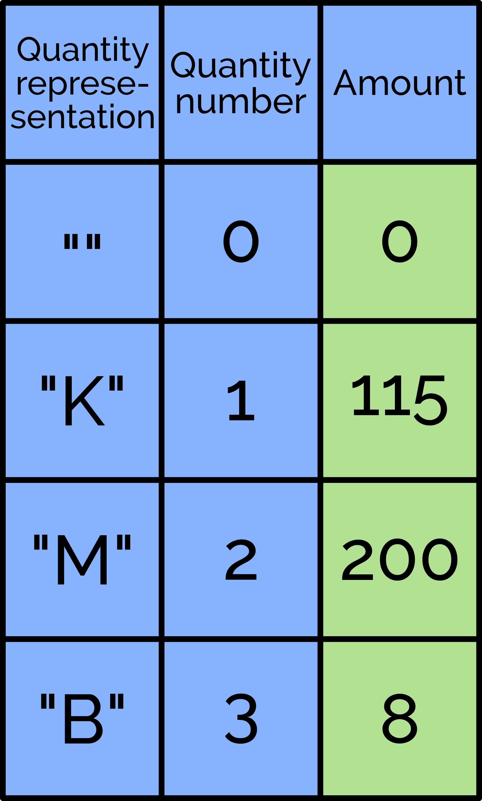

# Castle Clicker

The project represents a very simple idle-clicker game for Android.

## Mechanics

Gathering supplies is the most important part of the gameplay. When the player taps on a building, a relevant supply adds up to a storage which appears in the top side of the screen symbolized by icons and magnitudes of owned supplies. Building new buildings will have an impact on what supplies the player may gather. Specific supplies will be used to build distinct buildings. The position of the buildings is going to appear on the selected by player free tiles. All buildings will be connected by a road represented also by tiles but it will only be a visual element of the game. The last mechanic allowed for the player is an improvement of buildings. The buildings will have different enhancement possibilities which may help with gathering supplies and automate the selected buildings. The improvements will also cost supplies which types will depend on the type of the building.

## Game Enheancement

The game can be extended by a couple of interesting features. It has a lack of some mechanics that are important for increasing the playability. For example one of the things that should be implemented are enemies what would make the game more appealing by giving the player new tasks to do like fighting them. One of the classes called "Building" has its children called ResourceCreatingBuilding and UIOpeningBuilding. The second one is not yet used and mainly created for future buildings such as barracks. After clicking on that building, a panel would appear with the player's current army and the possibility to produce more depending on a number of specific possessed supplies. The next thing would be a mini-game allowing the player to gather supplies in some other ways. For example a small roulette (extremely popular future in loads of mobile games). The player would have to put some earned coins and randomly collect some awards in form of supplies.

## Operation of a 'Quantity' type

**Quantity** is a class that avoids the problem of big numbers. There is no such possibility to assign to variables any number, too big or too small. For example, the biggest float number is 3.40282347E+38 and it has to be assumed that the player would generate bigger amounts of supplies. Due to this problem, the class solves this problem and is able to create a number bigger than the given one. The idea is to create a list of integers and in every element store an amount in range between 0 and 999 which after connecting all the numbers, it results in a big number. In figure 4.13 there is shown an example of the class operating. The first column is a string representation of quantity. It means what kind of letter will appear after the displayed number. For example instead of 1000 - 1K. A quantity number is a numerical representation of the individual quantities. The amount is the actual number stored in the quantity. In the example shown in the figure, there can be seen that the result is 8,200,115,000.

## Features

- Scriptable Objects
- Big Numbers solution
- Roads adjustments according to adjacent buildings
- Voxel models

## Additional Resources

[MagicaVoxel](https://ephtracy.github.io/) by ephtracy
